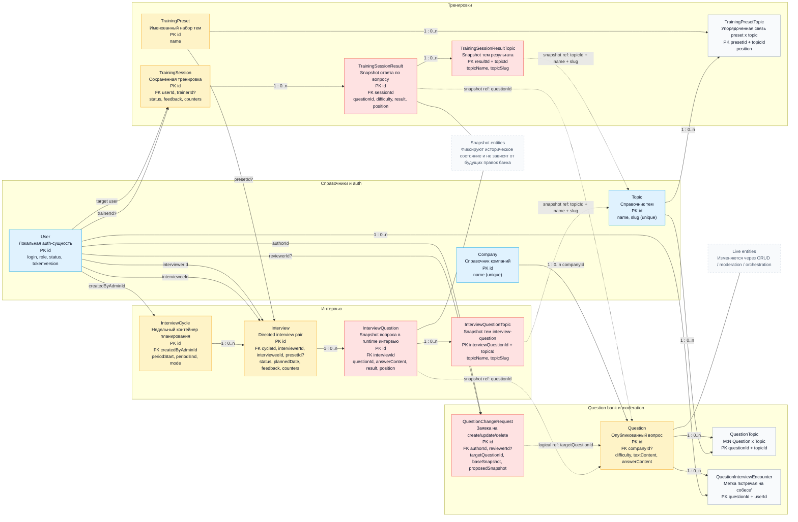

# Domain model graph

Источник: `backend/prisma/schema.prisma` и `backend/ARCHITECTURE.md`.

- Сплошная стрелка: физическая FK-связь.
- Пунктирная стрелка: logical reference или snapshot reference без Prisma relation.
- `drawio` остается редактируемым source of truth, этот файл нужен для быстрого чтения и diff-review.

## Краткая семантика моделей

- `User` управляет доступом, модерацией, тренировками и интервью, но в каждом контуре выступает в своей роли.
- `Company` и `Topic` это контролируемые справочники, на которые опирается опубликованный банк и сценарии подготовки.
- `Question` это только live-версия опубликованного вопроса; история изменений в ней не хранится.
- `QuestionChangeRequest` держит workflow модерации и before/after snapshots, а не полноценную FK-модель на все вложенные объекты.
- `TrainingSession*` это исторический слепок тренировки; данные специально денормализованы, чтобы аналитика не ломалась после правок банка.
- `Interview*` повторяет тот же snapshot-подход для отдельного weekly interview-контура.
