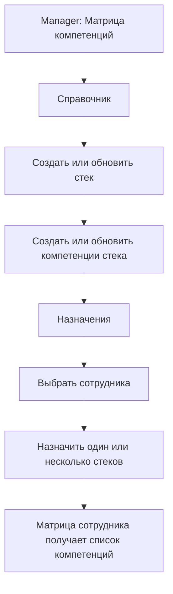
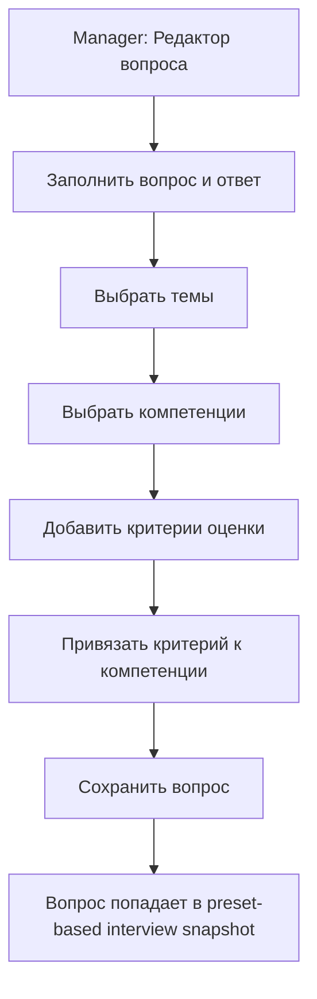
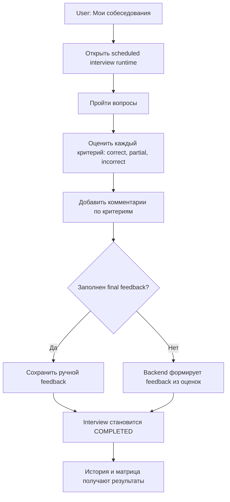
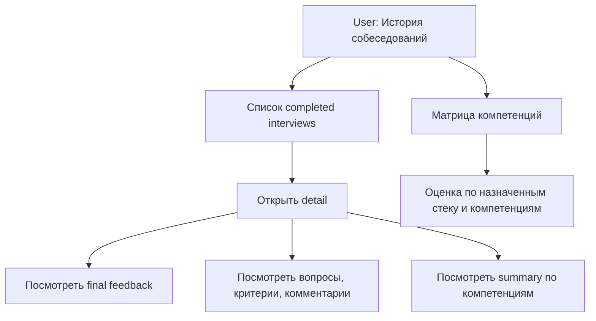
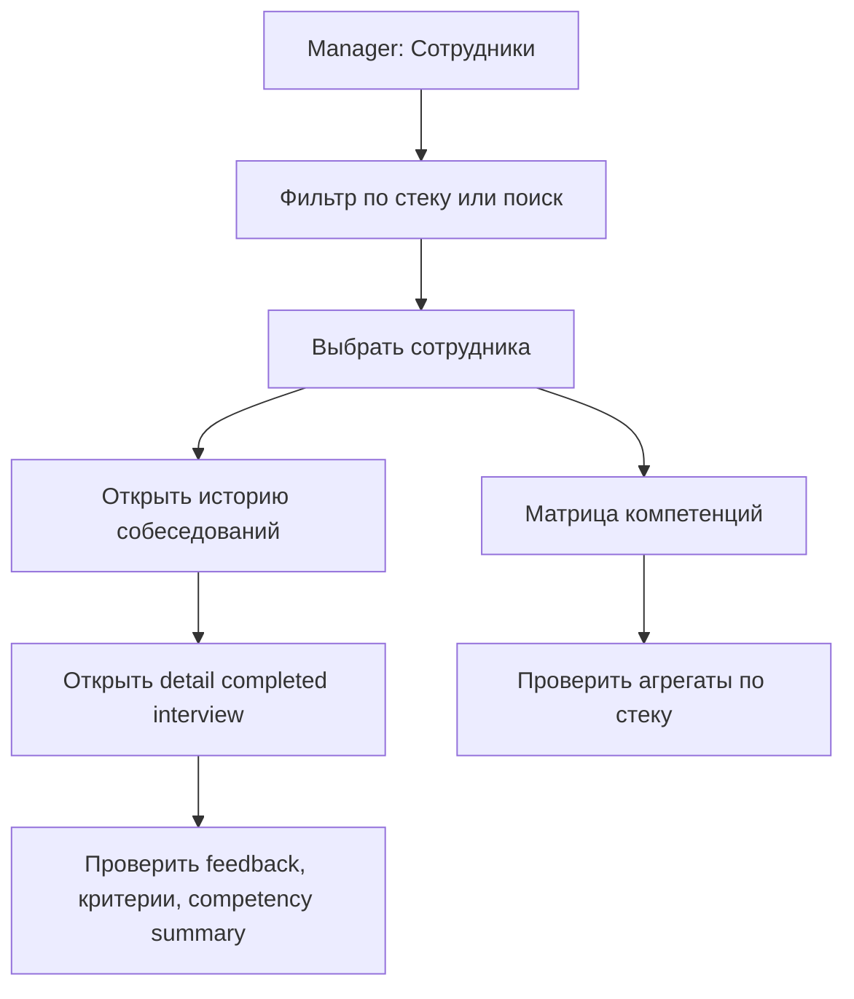

# Interview Competency Userflows

Дата анализа: 2026-05-03.

## Покрытие спеки

| Пункт | Статус | Реализация |
| --- | --- | --- |
| Сотрудник привязан к стеку | Закрыто | Manager назначает стеки сотруднику в матрице компетенций. |
| История собеседований сотрудников | Закрыто | User видит свою историю; Manager открывает историю выбранного сотрудника из раздела сотрудников. |
| Критерии оценки каждого вопроса | Закрыто | Вопрос хранит критерии, runtime показывает критерии, completion требует результат по каждому критерию. |
| Формирование финального feedback по собесу | Закрыто | Interviewer может ввести feedback вручную; при пустом поле backend формирует итоговый feedback из результатов и комментариев по критериям. |
| Матрица компетенций | Закрыто | Матрица строится по завершенным интервью и критериям с привязкой к компетенциям и стеку. |

## Userflow: Manager Настраивает Компетенции

## Userflow: Manager Готовит Вопросы

## Userflow: Interviewer Завершает Собеседование

## Userflow: Сотрудник Смотрит Результаты

## Userflow: Manager Анализирует Сотрудника

## Оставшиеся Пробелы

| Пробел | Риск | Приоритет |
| --- | --- | --- |
| В manager history нет фильтров по периоду, стеку и interviewer. | При большом числе интервью список станет шумным. | P2 |
| Нет отдельной страницы профиля сотрудника, объединяющей историю, матрицу и team analytics. | Manager идет по нескольким разделам. | P2 |
| Auto feedback не помечается как auto-generated. | Нельзя визуально отличить ручной feedback от сформированного системой. | P2 |
| Нет сценария редактирования feedback после completion. | Ошибка interviewer в feedback фиксируется без штатного исправления. | P3 |
| Нет проверки UI через e2e на manager employee history. | Риск регрессии маршрута и кнопки в таблице сотрудников. | P3 |
